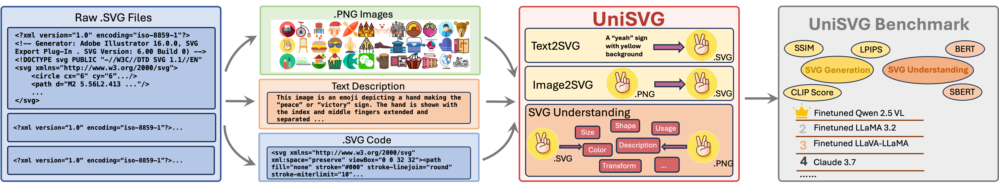

# 🏆 **Accepted to ACM MM 2025 Dataset Track!**

> **UniSVG** has been officially accepted to the **ACM Multimedia 2025 Dataset Track** 🎉  
> [🌐 Project Page](https://ryanlijinke.github.io/) | [🏆 Conference Website](https://acmmm2025.org/)

# UniSVG Dataset

UniSVG is a comprehensive dataset designed for unified SVG generation (from textual prompts and images) and SVG understanding (color, category, usage, etc.). It comprises 525k data items tailored for Multi-modal Large Language Models (MLLM) training and evaluation. You can access the dataset on [Hugging Face](https://huggingface.co/datasets/lili24/UniSVG).



## 🔥 Release

### [2025/09/22]
- 🔥 **Qwen2.5-VL-finetuned** released! [🌐 Jaireyu/Qwen2.5-VL-UniSVG-finetuned](https://huggingface.co/Jaireyu/Qwen2.5-VL-UniSVG-finetuned)

### [2025/07/31]
- 🔥 **UniSVG** got accepted by [🏆 ACM MM 2025 Dataset Track](https://acmmm2025.org/)🎉 [🌐 Project Page](https://ryanlijinke.github.io/) 

### [2025/06/03]
- 🔥 **UniSVG** dataset images updated! [📂 Dataset](https://huggingface.co/datasets/lili24/UniSVG/blob/main/png.zip) [🌐 Project Page](https://ryanlijinke.github.io/) 

### [2025/05/30]
- 🔥 **UniSVG** dataset opensourced! [📂 Dataset](https://huggingface.co/datasets/lili24/UniSVG) [🌐 Project Page](https://ryanlijinke.github.io/) 

## Project Homepage

For more information, please visit the [project homepage](https://ryanlijinke.github.io/).

## Dataset Summary

Unlike bitmap images, scalable vector graphics (SVG) maintain quality when scaled, frequently employed in computer vision and artistic design in the representation of SVG code. In this era of proliferating AI-powered systems, enabling AI to understand and generate SVG has become increasingly urgent. However, AI-driven SVG understanding and generation (U&G) remain significant challenges. SVG code, equivalent to a set of curves and lines controlled by floating-point parameters, demands high precision in SVG U&G. Besides, SVG generation operates under diverse conditional constraints, including textual prompts and visual references, which requires powerful multi-modal processing for condition-to-SVG transformation. Recently, the rapid growth of Multi-modal Large Language Models (MLLMs) have demonstrated capabilities to process multi-modal inputs and generate complex vector controlling parameters, suggesting the potential to address SVG U&G tasks within a unified model. To unlock MLLM's capabilities in the SVG area, we propose an SVG-centric dataset called UniSVG, comprising 525k data items, tailored for MLLM training and evaluation. To our best knowledge, it is the first comprehensive dataset designed for unified SVG generation (from textual prompts and images) and SVG understanding (color, category, usage, etc.).
## Usage

To install the dataset, you can use the `datasets` library from Hugging Face:

```bash
pip install datasets

```
Here is an example of how to load and use the dataset:

```python
from datasets import load_dataset

# Load the dataset
UniSVG_dataset = load_dataset("lili24/UniSVG")

# Print the first example
print(UniSVG_dataset[0])
```

## Prompts examples
### Data construction prompts examples
Please refer to `prompts/data_construction_example.py` for detailed information.
### Inference prompts examples
Please refer to `prompts/inference_prompts_examples.py` for detailed information.

## Finetuning example
This UniCoder evaluation release does not include UniSVG finetuning scripts or training framework snapshots. Please refer to the official UniSVG project for finetuning instructions.

## Evaluation example
For this repository, we recommend running UniSVG evaluation through the unified wrapper in `../simple_eval/run_pipeline.py`. See the root `README.md` for the full command.

## Acknowledgement
This repo benefits from the original UniSVG project and its upstream dependencies.
## Citation

If you use this dataset in your research, please cite the following paper:

```bibtex
@inproceedings{li2025unisvg,
  title={UniSVG: A Unified Dataset for Vector Graphic Understanding and Generation with Multimodal Large Language Models},
  author={Li, Jinke and Yu, Jiarui and Wei, Chenxing and Dong, Hande and Lin, Qiang and Yang, Liangjing and Wang, Zhicai and Hao, Yanbin},
  booktitle={Proceedings of the 33rd ACM international conference on multimedia},
  year={2025}
}
